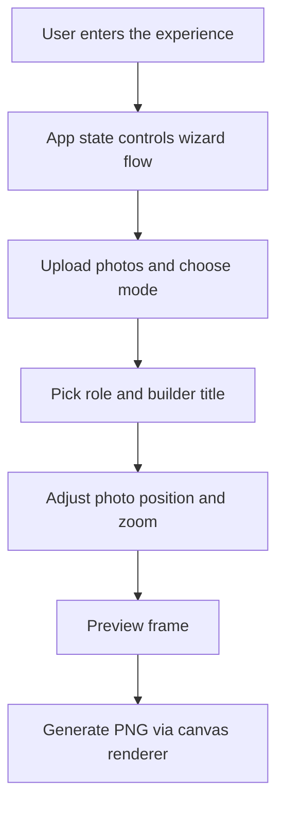

# FrameInGoa

FrameInGoa is a polished, event-themed web app built with Next.js and React for generating custom builder identity frames. It is designed for Hacker House Goa-style branding: users can create a personal or team-based visual identity card and export it as a high-resolution PNG.

## Overview

The app guides users through a simple multi-step experience:

1. Choose a solo or team mode
2. Upload one or more photos
3. Pick a role and builder title
4. Adjust the photo placement and zoom
5. Preview the result and export it as an image

The experience is intentionally lightweight and focused on a single goal: turning a profile photo and a few inputs into a striking, export-ready frame.

## What the Project Does

FrameInGoa helps users create:

- profile pictures for events or communities
- social post-style graphics
- team identity cards for collaborative groups
- visually polished builder-themed assets with a Goa-inspired editorial aesthetic

It is especially suited for hackathon and creator communities where a memorable identity graphic is useful for sharing online.

## Key Features

- Solo and team creation flows
- Support for up to five members in team mode
- Photo upload, replacement, drag positioning, zoom, and reset controls
- Role-based title generation with one-click rerolls
- Preview mode before export
- PNG export for both profile and post formats
- A custom visual system with tropical, editorial, and graphic design cues

## Architecture Overview

The app follows a straightforward frontend architecture centered around a single interactive stateful component and a canvas-based rendering layer.



### High-Level Structure

- The app entry point in [app/page.tsx](app/page.tsx) mounts the main experience.
- The main UI flow and all interactive state live in [components/App.tsx](components/App.tsx).
- The role/title database is stored in [lib/roles.ts](lib/roles.ts).
- The frame generation and PNG export logic lives in [lib/frame.ts](lib/frame.ts).

## How the App Works

### 1. UI and State Management

The core experience is driven by React state inside [components/App.tsx](components/App.tsx). The component manages:

- the current wizard screen
- whether the user is in solo or team mode
- the selected output format
- uploaded members and their photo adjustments
- the chosen role and title

This keeps the UI simple while making the flow feel guided and polished.

### 2. Data Model

Each member is represented as a structured object with:

- an id
- a name
- an uploaded photo reference
- a photo adjustment object containing zoom and position values

These values are used both for the live preview and for the final exported image.

### 3. Frame Rendering

The actual image export is not produced with HTML alone. Instead, the app uses the canvas API in [lib/frame.ts](lib/frame.ts) to draw:

- the background and decorative border
- the photo circle or team portrait layout
- the text content such as name, role, and builder title
- the Goa-inspired graphic accents and line art

This makes the export production-quality and consistent across devices.

### 4. Preview and Export Flow

The preview screen combines the current state with a visual mockup of the final frame. When the user clicks the download action, the app calls the frame renderer, converts the canvas into a PNG blob, and triggers a browser download.

## Project Structure

- [app/](app/) — Next.js app router pages and app-level layout
- [components/](components/) — UI components and the main experience controller
- [lib/](lib/) — reusable logic for roles, frame generation, and helper data
- [public/](public/) — static files and assets

## Tech Stack

- Next.js 14
- React 18
- TypeScript
- Lucide React

## Design Direction

The visual language is inspired by editorial design, tropical accents, and a refined Goa palette. The app leans toward:

- strong hierarchy
- restrained typography
- graphic motifs instead of overly playful decoration
- a polished, builder-first identity feel

## Getting Started

### Prerequisites

- Node.js 18 or newer
- npm

### Install dependencies

```bash
npm install
```

### Run locally

```bash
npm run dev
```

Then open http://localhost:3000 in your browser.

### Build for production

```bash
npm run build
```

## Future Possibilities

Possible next steps for the project include:

- saving generated frames to the cloud or local storage
- adding more export formats such as JPEG or WebP
- supporting custom themes or branding presets
- introducing user accounts or reusable design templates
